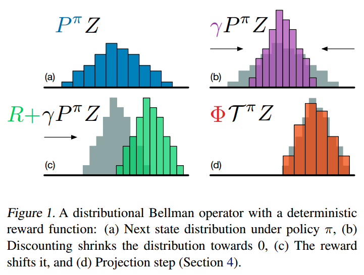
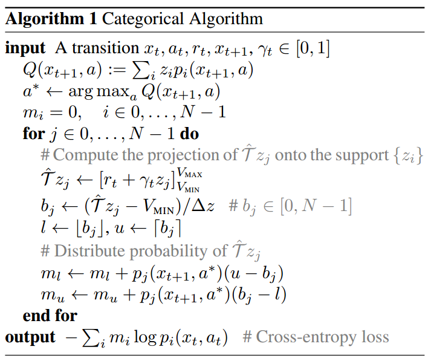
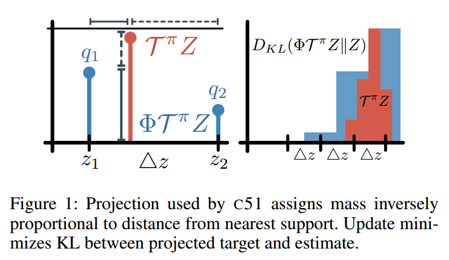

# A Distributional Perspective on Reinforcement Learning

[http://arxiv.org/abs/1707.06887](http://arxiv.org/abs/1707.06887)

> C51 approximates the distribution at each state by attaching variable (parametrized) probabilities $q_1, \ldots , q_N$ to fixed locations $z_1 ≤ \cdots ≤ z_N$.

Markov Decision Process $(\mathcal{X}, \mathcal{A}, R, P, \gamma)$. $P$ is the transition kernel $P(\cdot | x, a)$

the discounted sum of future rewards.

$$Z^\pi (x, a) = \mathbb{E}_{t=0}^\infin \gamma^t R(x_t, a_t)$$

action-value function

$$
\begin{aligned}
Q^\pi (x, a) &= \mathbb{E} [Z^\pi (x, a)] \\
&= \mathbb{E} [R(x, a) + \gamma Q(x', a')]
\end{aligned}
$$

Bellman optimality operator

$$
\mathcal{T} Q(x, a) := \mathbb{E}[R(x, a) + \gamma \max_{a'} Q(x', a')]
$$

the transition operator

$$
P^\pi Z(x, a) \overset{D}{:=} Z(X', A') \\
X' \sim P(\cdot | x, a), A' \sim \pi(\cdot | X')
$$

where we use capital letters to **emphasize the random nature** of the next state-action pair $(X', A')$.

distributional Bellman operator

$$
\mathcal{T}^\pi Z (x, a) \overset{D}{:=} R(x, a) + \gamma P^\pi Z(x, a)
$$

A distributional Bellman operator with a deterministic reward function:

The most important is **Projected Bellman Update**, that is, the (d) Projection step in the figure above. because the Bellman update $\mathcal{T}Z_\theta$ and our parametrization $Z_\theta$ almost always have **disjoint supports**.

Parameter explanation:

- $\Delta z := \frac{V_{MAX}-V_{MIN}}{N - 1}, N = 51, V_{MAX}=10, V_{MIN}=-10$
- $z_i = V_{MIN} + i \Delta z: 0 \leq i < N$

This figure is from [QR-DQN]. We can simply take a closer look:

- $l = z_1, u = z_2$
- $q_1 = p_j(x_{t+1}, a^*)(z_2 - b_j)$
- $q_2 = p_j(x_{t+1}, a^*)(b_j - z_1)$

