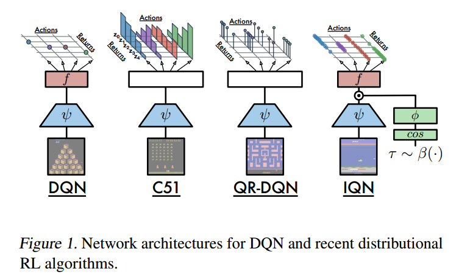
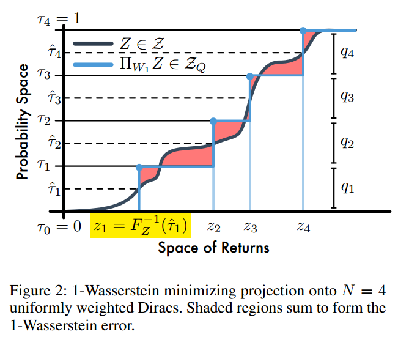
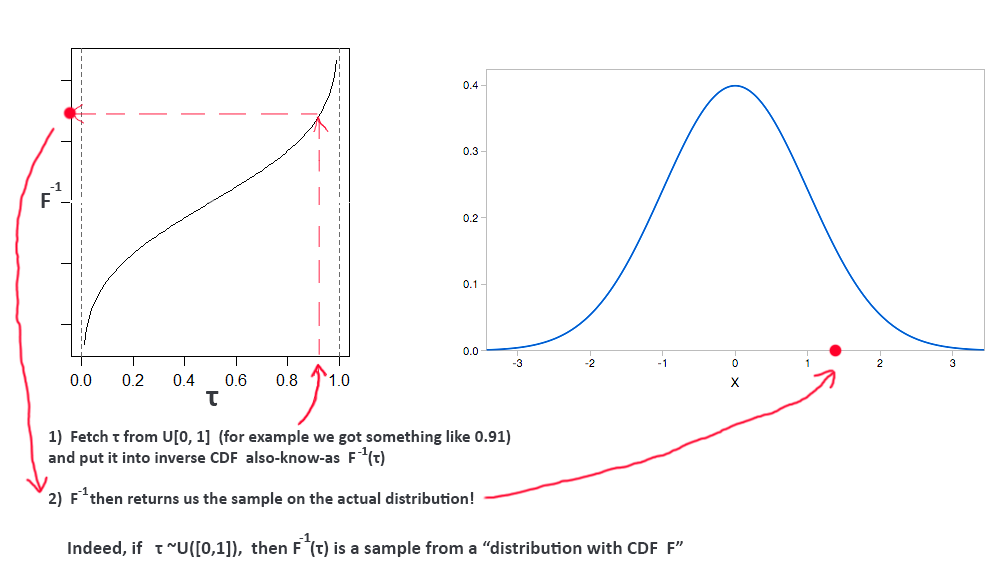
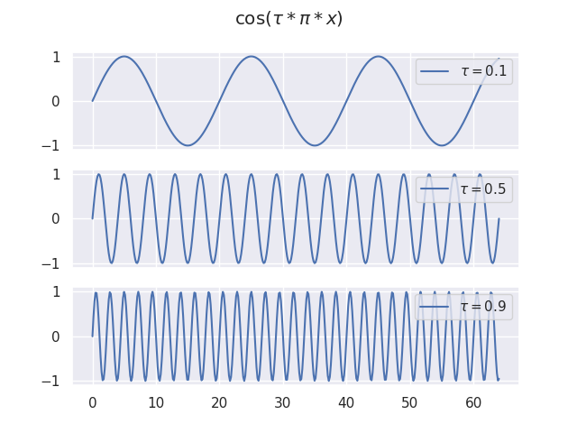

# Implicit Quantile Networks for Distributional Reinforcement Learning

[https://arxiv.org/pdf/1806.06923.pdf](https://arxiv.org/pdf/1806.06923.pdf)

> quantile: dividing a probability distribution into areas of equal probability.

Markov Decision Process $(\mathcal{X}, \mathcal{A}, R, P, \gamma)$

the discounted sum of future rewards.

$$Z^\pi (x, a) = \mathbb{E}_{t=0}^\infin \gamma^t R(x_t, a_t)$$

action-value function

$$
\begin{aligned}
Q^\pi (x, a) &= \mathbb{E} [Z^\pi (x, a)] \\
&= \mathbb{E} [R(x, a) + \gamma Q(x', a')]
\end{aligned}
$$

Bellman optimality operator

$$
\mathcal{T} Q(x, a) := \mathbb{E}[R(x, a) + \gamma \max_{a'} Q(x', a')]
$$

distributional Bellman equation

$$
Z^\pi (x, a) = R(x, a) + \gamma Z^\pi (X', A')
$$

## Difference

Assume that num_actions = 4.

- DQN, output 4 values for each action.
- C51, output 4 distributions for each distribution. The support are 50 fixed points uniformly in $[V_{min}, V_{max}]$. The probability is softmax of logits. For each action:
    $$Q=\sum_{i=0}^{50} z_i \cdot prob_i$$
- QR-DQN, The probability is $1/N(prob_i = \frac{1}{N}$), The corresponding value is $z = F_Z^{-1}(\hat{\tau}_i)$ where $F^{-1}$ denotes Inverse CDF. For each action:
    $$Q=\sum_{i=0}^N z_i \cdot \frac{1}{N}$$
    
- IQN, Suggest [https://datascience.stackexchange.com/questions/40874/how-does-implicit-quantile-regression-network-iqn-differ-from-qr-dqn](https://datascience.stackexchange.com/questions/40874/how-does-implicit-quantile-regression-network-iqn-differ-from-qr-dqn). IQN network represents an Inverse CDF itself. That is, given a request of some scalar 'amount' value (sample from $U[0, 1]$), the Inverse CDF will output a value from the actual distribution, that sits at that amount. Here, $N$ has no bussiness with quantile, instead it represent the number of samples. $\frac{1}{N}$ denotes mean not probability.
    $$Q=\frac{1}{N} \sum_{i=0}^N z_i$$
    

## Main

Suggest [http://www-personal.umich.edu/~shangw/IQN_tutorial.pdf](http://www-personal.umich.edu/~shangw/IQN_tutorial.pdf)

1. Give a training example $x \in \mathcal{X}$
2. Encode $x$ via a neural net $\psi(x)$, where $\psi : \mathcal{X} → R^d$
3. Sample $\tau \sim U[0, 1]$
4. Encode each $\tau_i$
   $$\phi_j(\tau) := ReLU(\sum_{i=0}^{n-1} \cos(\pi i \tau) w_{ij} + b_j)$$
   1. Cosine encoding: $\cos(\pi i \tau)$
   2. a single-layer MLP with $ReLU$ as activation function.
5. Encode the element-wise product of $\psi(x)$ and $\phi(\tau)$
    $$Z_\tau(x, a) \approx f(\psi(x) \odot\phi(\tau))$$

## Question

### Why $\cos$ and $1 \sim 64$

This article [https://zhuanlan.zhihu.com/p/338592312](https://zhuanlan.zhihu.com/p/338592312) may help a little. Actually, first I think about `Positional Encoding` in `Transformer`. From my pespective, the key is that the **frequency** of $\cos$ or $\sin$ is determined by $\tau_i$. The array $[\cos(\pi \tau_i), \cos(2\pi \tau_i), \cos(3\pi \tau_i), \ldots, \cos(64\pi \tau_i)]$ **implicitly** represents the value of $\tau_i$.

