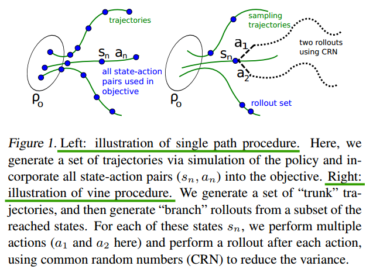

# Trust Region Policy Optimization

[https://arxiv.org/pdf/1502.05477.pdf](https://arxiv.org/pdf/1502.05477.pdf)

有保证的单调递增策略梯度

## 指出问题

没啥问题，直接提出单调递增策略梯度

## 理论证明

$(\mathcal{S}, \mathcal{A}, P, r, \rho_0, \gamma)$ \
$\rho_0$ : 初始状态 $s_0$ 的分布 \
那么期望折扣回报可以表示为

$$\eta(\pi)=\mathbb{E}_{s_0,a_0,\ldots} \left[ \sum_{t=0}^\infty \gamma^t r(s_t)\right], \quad \text{where} \\
s_0 \sim \rho_0,\ a_t \sim \pi(a_t|s_t),\ s_{t+1} \sim P(s_{t+1}|s_t,a_t)$$

状态分布表示为

$$\rho_{\tilde\pi}(s)=\sum_{t=0}^\infty P(s_t=s|s_0,\pi)$$

[[Kakade 2002]](https://people.eecs.berkeley.edu/~pabbeel/cs287-fa09/readings/KakadeLangford-icml2002.pdf) 中提到，对于任意两种策略 $\tilde\pi$ 和 $\pi$，有

$$\eta(\tilde\pi)=\eta(\pi)+\sum_s \rho_{\tilde\pi}(s)\sum_a \tilde\pi(a|s)A_\pi (s,a)$$

令 $\pi_{old}$ 为当前策略，令 $\pi'=\argmax_{\pi'}L_{\pi_{old}}(\pi')$. $\pi_{new}$ 是一个混合策略（mixture）：

$$\pi_{new}=(1-\alpha)\pi_{old}(a|s)+\alpha\pi'(a|s)$$

根据 [[Kakade 2002]](https://people.eecs.berkeley.edu/~pabbeel/cs287-fa09/readings/KakadeLangford-icml2002.pdf) 可知

$$\begin{aligned}
\eta(\pi_{new}) - \eta(\pi_{old}) &= \sum_{s} \rho_{\pi_{new}}(s) \sum_a \pi_{new}(a|s) A_{\pi_{old}}(s,a) \\
&\geq\sum_{s} \rho_{\pi_{old}}(s) \sum_a \pi_{new}(a|s) A_{\pi_{old}}(s,a) - 2 \alpha \epsilon \left( \frac{1}{1-\gamma} - \frac{1}{1-\gamma(1-\alpha)} \right) \\
&=\sum_{s} \rho_{\pi_{old}}(s) \sum_a \pi_{new}(a|s) A_{\pi_{old}}(s,a) - \frac{2 \epsilon \gamma}{(1-\gamma)^2} \alpha^2 \\
\text{where } \epsilon &= \max_s \left| \mathbb{E}_{a \sim \pi'(a|s)} [A_\pi(s,a)] \right|
\end{aligned}$$

这里对下界做了一些调整，更加简洁一点

$$\begin{aligned}
\frac{1}{1-\gamma}-\frac{1}{1-\gamma(1-\alpha)}&=\frac{1-\gamma(1-\alpha)-(1-\gamma)}{(1-\gamma) [1-\gamma(1-\alpha)]} \\
&=\frac{\alpha \gamma}{(1-\gamma) [1-\gamma(1-\alpha)]} \\
&\geq \frac{\alpha \gamma}{(1-\gamma)^2}
\end{aligned}$$

$\pi_{new}$ 是一个混合策略，$\alpha$ 是混合系数，但是实际上混合策略很少被使用，导致上述公式难以解决实际问题。于是，使用总变化散度（total variation divergence）$D_{TV}(p\ ||\ q)=\frac{1}{2}\sum_i |p_i-q_i|$ 来取代 $\alpha$，其中 $p\ q$ 是离散概率分布。把 $D_{TV}^{\max}(\pi,\tilde\pi)$ 定义为

$$D_{TV}^{\max}(\pi,\tilde\pi)=\max_s D_{TV}(\pi(\cdot|s)\ ||\ \tilde\pi(\cdot|s))$$

**Theorem 1.** 令 $\alpha = D_{TV}^{\max}(\pi,\tilde\pi)$。下界依旧成立：

$$\eta(\pi_{new}) - \eta(\pi_{old}) \geq \sum_{s} \rho_{\pi_{old}}(s) \sum_a \pi_{new}(a|s) A_{\pi_{old}}(s,a) - \frac{4 \epsilon \gamma}{(1-\gamma)^2} \alpha^2 \\
\text{where } \epsilon = \max_{s,a} \left| A_\pi(s,a) \right|$$

原文里的证明有点复杂，有时间再看吧...

下面，总变化散度（total variation divergence）和 KL 散度其实是有关系的：$D_{TV}(p\ ||\ q)^2 \leq D_{KL}(p\ ||\ q)$。令 $D_{KL}^{\max}(\pi,\tilde\pi)=\max_s D_{KL}(\pi(\cdot|s)\ ||\ \tilde\pi(\cdot|s))$，那么下界成立：

$$\eta(\pi_{new}) - \eta(\pi_{old}) \geq \sum_{s} \rho_{\pi_{old}}(s) \sum_a \pi_{new}(a|s) A_{\pi_{old}}(s,a) - \frac{4 \epsilon \gamma}{(1-\gamma)^2} D_{KL}^{\max}(\pi,\tilde\pi)$$

实际上，如果我们使用惩罚系数 C，步长将会变得非常非常小。一种可行的办法是把 KL 那一项作为约束条件：

$$\text{maximize}_\theta \sum_{s} \rho_{\pi_{old}}(s) \sum_a \pi_{new}(a|s) A_{\pi_{old}}(s,a) \\
\text{subject to}\ D_{KL}^{\max}(\pi,\tilde\pi) \leq \delta$$

由于计算 $D_{KL}^{\max}(\pi,\tilde\pi)$ 比较麻烦，可以用平均 KL 散度代替：

$$\overline D_{KL}^\rho (\pi,\tilde\pi):=\mathbb{E}_{s \sim \rho} [D_{KL} (\pi(\cdot|s)\ ||\ \tilde\pi(\cdot|s))]$$

## 重要性采样

实际上的数据由蒙特卡洛采样得到，我们使用采样来对公式进行一下替换：

$$\begin{aligned}
\sum_{s} \rho_{\pi_{old}}(s) \sum_a \pi_{new}(a|s) A_{\pi_{old}}(s,a)&=\mathbb{E}_{s \sim \rho_{\pi_{old}}} \sum_a \pi_{new}(a|s) A_{\pi_{old}}(s,a) \\
&=\mathbb{E}_{s \sim \rho_{\pi_{old}}} \sum_a \pi_{old}(a|s) \frac{\pi_{new}(a|s)}{\pi_{old}(a|s)} A_{\pi_{old}}(s,a) \\
&=\mathbb{E}_{s \sim \rho_{\pi_{old}}} \mathbb{E}_{a \sim \pi_{old}} \frac{\pi_{new}(a|s)}{\pi_{old}(a|s)} A_{\pi_{old}}(s,a) \\
\end{aligned}$$

因此，代理目标（surrogate objective）可以写为：

$$\text{maximize}_\theta \mathbb{E}_{s \sim \rho_{\pi_{old}}} \mathbb{E}_{a \sim \pi_{old}} \frac{\pi_{new}(a|s)}{\pi_{old}(a|s)} A_{\pi_{old}}(s,a) \\
\text{subject to}\ \mathbb{E}_{s \sim \rho_{\pi_{old}}} [D_{KL} (\pi_{old}(\cdot|s)\ ||\ \pi_{new}(\cdot|s))] \leq \delta$$

然后这里介绍了两种采样方式，分别是单路径（single path）和藤蔓（vine）。单路径法很简单，就是蒙特卡洛法。藤蔓法比较难以理解。

藤蔓法，首先使用蒙特卡洛方法得到一条轨迹，然后在这条轨迹选择一个大小为 $N$ 的状态子集，用 rollout set 表示。对于该状态子集中的每个状态 $s_n$，我们通过 $a_{n,k} \sim q(\cdot|s_n)$ 采样 $K$ 个动作。实际上发现，对于连续动作问题（如 robotic locomotion），$q(\cdot|s_n)=\pi_\theta(\cdot|s_n)$ 有效果，对于离散动作问题（如 atari），随机分布有效果，因为可以实现更好的探索。

但是由于藤蔓法很麻烦，单单把 gym 环境重置到指定状态就很难做到...所以藤蔓法具体细节这里就不写了。

## 实用算法

再写一下刚刚提到的代理目标（surrogate objective）：

$$\text{maximize}_\theta \mathbb{E}_{s \sim \rho_{\pi_{old}}} \mathbb{E}_{a \sim \pi_{old}} \frac{\pi_{new}(a|s)}{\pi_{old}(a|s)} A_{\pi_{old}}(s,a) \\
\text{subject to}\ \mathbb{E}_{s \sim \rho_{\pi_{old}}} [D_{KL} (\pi_{old}(\cdot|s)\ ||\ \pi_{new}(\cdot|s))] \leq \delta$$

我们定义

$$J(\theta)=\mathbb{E}_{s \sim \rho_{\pi_{old}}} \mathbb{E}_{a \sim \pi_{old}} \frac{\pi_{new}(a|s)}{\pi_{old}(a|s)} A_{\pi_{old}}(s,a)$$

那么 $\text{maximize}_\theta J(\theta)$ 可以写为 $\text{maximize}_\theta \nabla_\theta J(\theta)^T \Delta \theta$

我们知道通过 KL 散度的二阶泰勒展开，可以得到和费谢尔矩阵的关系：

$$KL(f(x;\theta)||f(x;\theta+\Delta\theta))\approx\frac{1}{2} \Delta\theta^T F \Delta\theta$$

看一下 KL 散度的二阶导数（$\theta^-$ 表示参数为常值）：

这里是参考 [https://zhuanlan.zhihu.com/p/106984936](https://zhuanlan.zhihu.com/p/106984936)，作者讲得好，建议看。

$$\begin{aligned}
\nabla_\theta^2 KL(f(x;\theta^-)||f(x;\theta))&=\nabla_\theta^2 \left[ \int f(x;\theta^-) \log f(x;\theta^-)dx-\int f(x;\theta^-) \log f(x;\theta)dx \right] \\
&=-\int f(x;\theta^-) \nabla_\theta^2 \log f(x;\theta) dx \\
&=-E \left[ \nabla_\theta^2 \log f(x;\theta) \right] \\
&= F
\end{aligned}$$

文章中使用 KL 散度的二阶导 $H=\nabla_\theta^2KL(\cdot)$ 来作为费谢尔矩阵 $F$ 的估计。

因此，我们可以把代理目标重写为：

$$$$

$$\text{maximize}_\theta \nabla_\theta J(\theta)^T \Delta \theta \\
\text{subject to }\frac{1}{2} \Delta\theta^TH\Delta\theta = \epsilon$$

这是一个简单的约束优化问题，使用拉格朗日乘数法（Lagrange Multiplier Method）来解：

$$f(\theta)=\nabla_\theta J(\theta)^T \Delta \theta + \lambda(\frac{1}{2} \Delta\theta^TH\Delta\theta - \epsilon)$$

则有方程组

$$\begin{cases}
\nabla_{\Delta\theta}f(\theta)=\nabla_\theta J(\theta)+\lambda H \Delta\theta = 0 &(1)\\
\frac{1}{2} \Delta\theta^TH\Delta\theta - \epsilon = 0 &(2)\\
\end{cases}$$

由 $(1)$ 解得 $\Delta\theta=-\frac{1}{\lambda}H^{-1}g$，代入 $(2)$ 中得（注意，$H$ 是海森矩阵，是对称的，即 $H^T=H$，其逆矩阵也是对称矩阵）

$$\begin{aligned}
\frac{1}{2 \lambda^2}g^T(H^{-1})^THH^{-1}g&=\epsilon \\
\frac{1}{2\epsilon} g^TH^{-1}g&=\lambda^2 \\
\sqrt{\frac{g^TH^{-1}g}{2\epsilon}}&=\lambda
\end{aligned}$$

代回得

$$\begin{aligned}
\Delta\theta&=-\frac{1}{\lambda}H^{-1}g \\
&=-\sqrt{\frac{2\epsilon}{g^TH^{-1}g}}H^{-1}g
\end{aligned}$$
